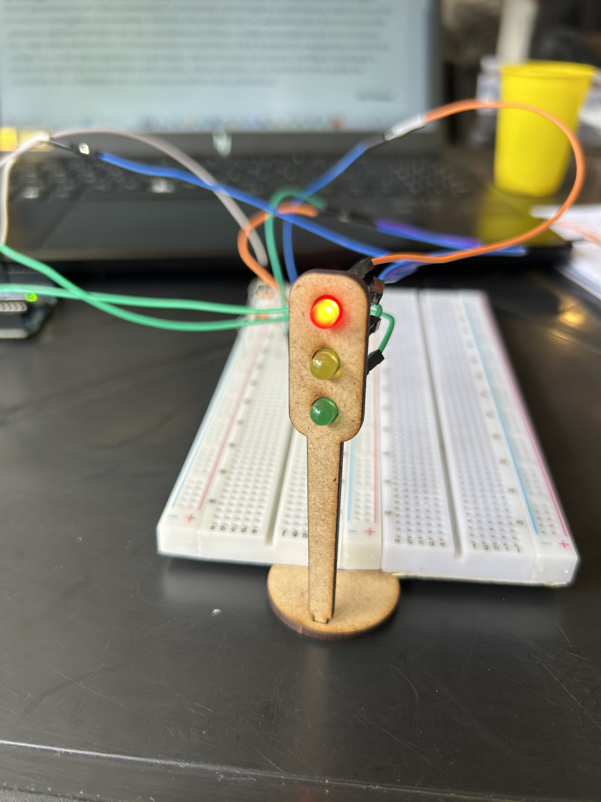
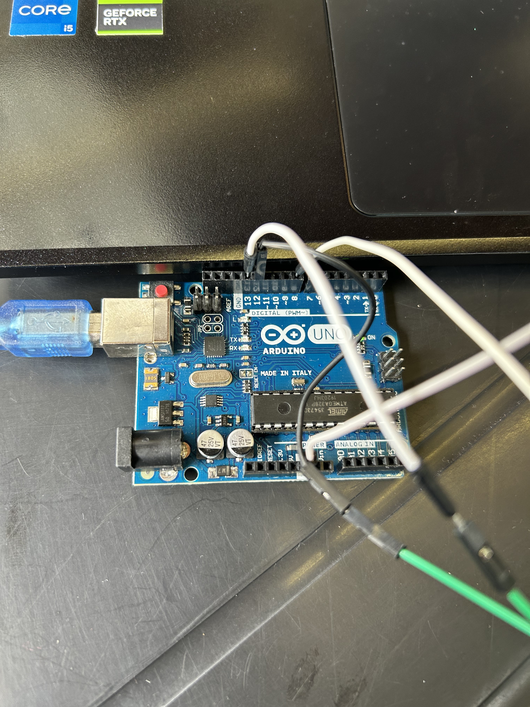
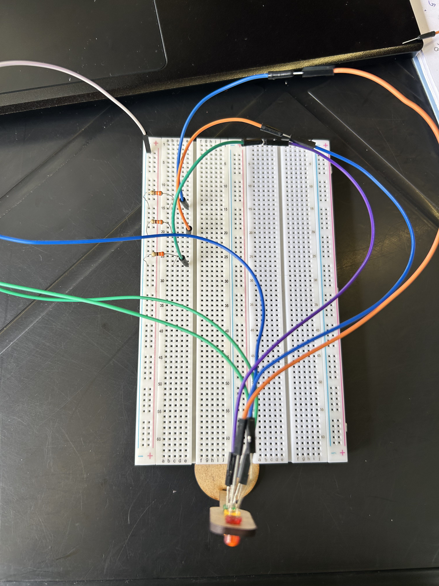
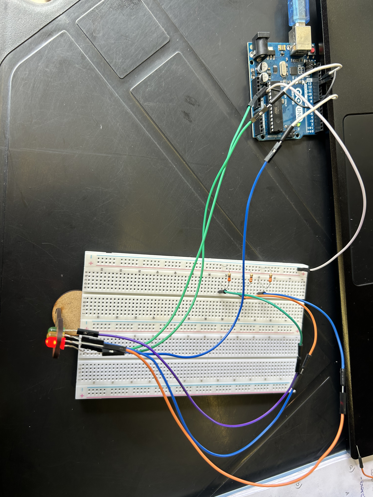

# Tutorial
&nbsp;&nbsp;&nbsp;&nbsp;Nesse projeto queremos fazer um sinal de trânsito fucional com leds que, em loop, deixe o led verde 4 segundos ligado, deslique, ligue o led amarelo, o deixe ligado por 2 segundos, o desligue e em seguida ligue o vermelho por somente 6 segundos antes de iniciar esse ciclo novamente. 

### Componentes
&nbsp;&nbsp;&nbsp;&nbsp;Para esse resultado ser atingido, serão precisos alguns componentes:
|**Componente**|**Quantidade**|
|-------------|-----------|
|Cabo jumper macho-femea|6|
|Resistor 220V|3|
|Cabo jumper macho-macho|1|
|Arduino uno|1|
|Cabo usb|1|
|Porta led de mdf que imita um sinal de trânsito (opcional)|1|

### Montagem
&nbsp;&nbsp;&nbsp;&nbsp;Começando pela montagem dos fios, é preciso encaixar os leds no porta led de mdf garantindo que os leds estejam alinhados quanot aos lados positivos e negativos para que a montagem seja mais simples e que erros de polaridade sejam evitados. Essa montagem não é estritamente necessária para o funcionamento do sinal, porém o deixa mais parecido com sua aparencia real.

&nbsp;&nbsp;&nbsp;&nbsp;Em seguida, é necessário conectar 3 fios macho-femea aos leds e ao arduino. Conecte a perna positiva dos leds no lado femea do fio e o lado macho a porta que quer usar em seu código, no meu caso optei pelas portas 13, 12 e 8 para os leds, verde, amarelo e vermelho, respectivamente. Você pode optar pela porta que desejar, porém cheque a pinagem da placa para garantir que o pino que escolheu seja compatível com os leds. Isso, permitirá que os leds sejam controlados pelo código posteriormente, lá, os leds serão referenciados pinos escolhidos, então essa parte é essencial. 

&nbsp;&nbsp;&nbsp;&nbsp;Depois, os 3 resistores de 220V devem ser colocados com uma perna na linha (escolha 3 diferentes, uma para cada resistor) que deseja e a outra na coluna azul que indica negativo. O uso desses resistores é necessário para evitar que algum led queime devido a receber uma corrente mais alta que ele aguanta. Para que a coluna negativa funcione será necessário que seja usado um cabo jumper macho-macho com um lado colocado em qualquer buraco da respectiva coluna da protoboard e o outro no pino GND no Arduino uno. 

&nbsp;&nbsp;&nbsp;&nbsp;Para completar o circuito falta somente usar 3 cabos macho-femea (um para cada led) e plugar a parte feminina dos fios nos respectivos leds e a parte masculina nas mesmas linhas que foram colocados os resistores, garantindo que cada led seja tenha a perna negativa conectada ao seu respectivo resistor por uma coluna exclusiva e a postiva ligada ao pino correspondente. 

**Cheque novamente as imagens a cima para completo entendimento**

&nbsp;&nbsp;&nbsp;&nbsp;Por fim, é necessário conectar o Arduino uno ao computador por meio do cabo usb. Assim, será possível rodar o código presente em no seu arquivo. 

&nbsp;&nbsp;&nbsp;&nbsp;No fim o sistema completo deve ter essa cara:

### Vídeo do funcionamento geral do projeto
link para o vídeo de fucnionamento do projeto: https://youtube.com/shorts/dDCer6qn1JE?feature=share
*O código do projeto está dentro da pasta src, o nome do arquivo é proj.h*

### Avaliação em pares
#### Avaliação Luana Lima
|**Critério**|**Avaliação**|**Observação**|
|-------------|-----------|-------------|
|Montagem física com cores corretas, boa disposição dos fios e uso adequado de resistores|3||
|Temporização adequada conforme tempos medidos com auxílio de algum instrumento externo|3||
|Código implementa corretamente as fases do semáforo e estrutura do código (variáveis representativas e comentários)|2,8|Adicionar comentários|
|Ir além: Implementou um componente de extra, fez com millis() ao invés do delay() e/ou usou ponteiros no código|1||
#### Avaliação Mariana Pereira
|**Critério**|**Avaliação**|**Observação**|
|-------------|-----------|-------------|
|Montagem física com cores corretas, boa disposição dos fios e uso adequado de resistores|3||
|Temporização adequada conforme tempos medidos com auxílio de algum instrumento externo|3||
|Código implementa corretamente as fases do semáforo e estrutura do código (variáveis representativas e comentários)|2,9|Adicionar comentários|
|Ir além: Implementou um componente de extra, fez com millis() ao invés do delay() e/ou usou ponteiros no código|1||

